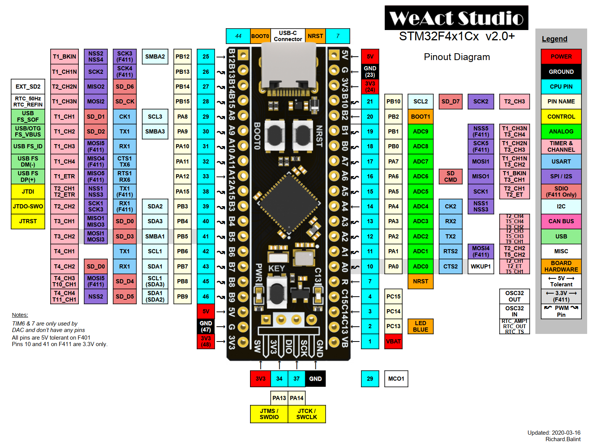

# Introduction
A pin on an Arduino-core device can be configured to operate in one of several modes.

For example, 
a digital pin may be configured for input, output, and some digital pins may be 
used for analog output (PWM) operation.

Analog input pins
are even more flexible.
They may be configured for analog input, digital input, or digital output operation.

## Arduino Brand MCUs

Arduino board pin-numbers are specified using a modified version of standard Arduino 
pin-numbers. 

### Digital Pin Numbers
Digital pin-numbers are specified using a single integer value, such as 3 for digital 
pin 3.

### Analog Pin Numbers
Analog pin-numbers are also specified using a single integer value using the analog 
pin-number without the "A." For example, pin A4 is identified simply as 4. 

## ESP-8266
### Digital Pin Numbers

The ESP-8266 digital pin-numbers are mapped using the GPIO pin-number mapped according to 
the 
[variants](https://github.com/esp8266/Arduino/tree/master/variants) file for a specific 
board in the ArduinoCore for the ESP-8266.

Using a NodeMCU as an example, to use D2, its GPIO pin-number is 4.

### Analog Pin Numbers
The ESP8266 has a single Analog input pin, and it is specified as pin 0.

##STM32
### Digital Pin Numbers

The STM32 digital pin-numbers are mapped using the GPIO pin-number mapped according to 
the 
[variants](https://github.com/stm32duino/Arduino_Core_STM32/blob/master/variants/STM32F4xx/F411C(C-E)(U-Y)/variant_BLACKPILL_F411CE.h)
file for a specific STM32 shown in the STM32 Arduino Core.
Using the BlackPill MCU as an example, the pin marked as B3 on the board is specified 
as 19.

### Analog Pin Numbers
Analog pin-numbers are specified in the range of 0 to 15. The variants file shows how 
those values are mapped as described in the specific variants file for each MCU.

## SPI Pins
Telemetrix uses the standard SPI pins as mapped in each specific variants file.

## I2C Pins
Telemetrix uses the standard I2C pins as mapped in each specific variants file.

 
 

Copyright (C) 2020 Alan Yorinks. All Rights Reserved.
