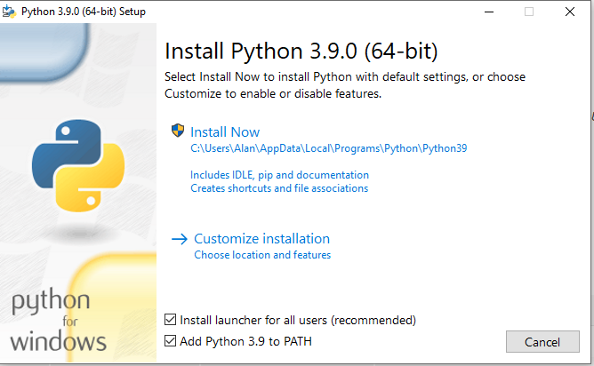

## INSTALLING PYTHON 
### Windows Users

You must use Python 3.7 or greater.

To install Python 3, go to the
<a href="https://www.python.org/" target="_blank">Python home page,</a>
and download the latest Python 3 distribution for your operating system.

If there is a checkbox to add Python 3.x to your path during the installation process, 
make sure it is checked before proceeding with the installation.



### Linux Users
Python 3.7.2 or greater is required.

#### Raspberry Pi Raspbian Users
If your copy of Raspbian is using Python 3.7 or greater, you should be all set to proceed.

#### Ubuntu and Other Debian Based Linux Distributions

You may need to install pip3. To check, open a terminal and type:
```python
which pip3
```
If a path to pip3 is not reported, you will need to install it.

Open a terminal window and type:
```
  sudo apt-get install pip3-python
```

You should then make sure you have the latest version by typing:
```python
sudo pip3 install -U pip
```

#### For All Other Linux Distributions

Refer to your distribution's instructions.

### Mac Users
Python 3.7.2 or greater is required.


1. Install Python 3.7.x from [https://www.python.org/downloads/](https://www.python.org/downloads/)
 or via [homebrew](http://brew.sh/)
2. Download get-pip.py from [https://bootstrap.pypa.io/get-pip.py](https://bootstrap.pypa.io/get-pip.py) and
install (this should already be installed if Python was installed from python.org or homebrew):

```
curl -O https://bootstrap.pypa.io/get-pip.py
sudo python3 get-pip.py
```


### Verify The Python Installation

Use the [procedure shown here](../python_3_verify) to verify that you have successfully
installed the correct version of Python for your
computer.
<br>
<br>


Copyright (C) 2020-21 Alan Yorinks. All Rights Reserved.

