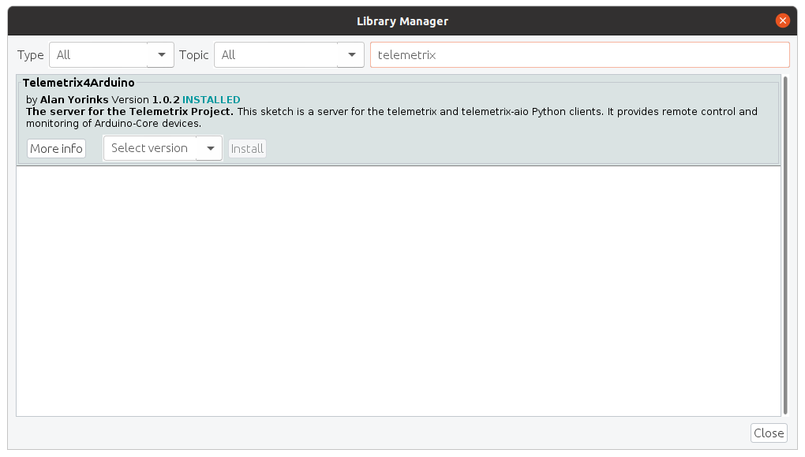
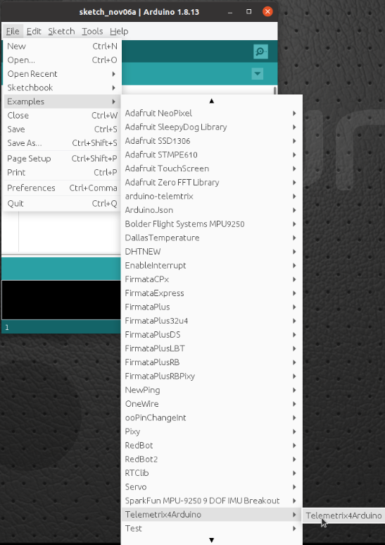
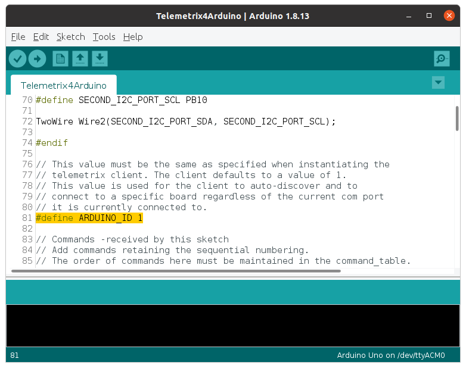
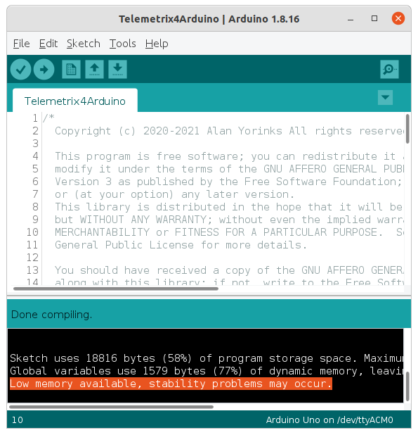

# Telemetrix4Arduino

## Installation Instructions


<p>1. Open the Arduino IDE and select Tools/Manage Libraries.</p>


<p>2. Enter "Telemetrix4Arduino in the search box.</p>



<p>3. Click on the Install button. You will be prompted to allow the installation
of additional libraries. Accept the installation for all.</p>

<p>4. Upload Telemetrix4Arduino to your Arduino-Core board by selecting File/Examples/Telemetrix4Arduino/Telemetrix4Arduino
and then clicking the upload button on the IDE.</p>



## Setting The Telemetrix4Arduino Instance ID

Telemetrix4Arduino, in conjunction with the Telemetrix Project clients, associates a 
specific Arduino board with your application.

If you only have a single Arduino connected at a time, you do not need to do anything. However,
if you wish to run multiple Arduinos, you must assign a unique ID number to each
Arduino. The ID number is then supplied as an input parameter when your application
 is instantiated.



If you wish to change the instance_id for the server, you must edit the sketch code 
and upload the changes to the Arduino.

To match the instance_id on the client side, you will need to specify the arduino_instance id parameter
when instantiating the client class:

```
def __init__(self, com_port=None, arduino_instance_id=1,
                 arduino_wait=4, sleep_tune=0.000001,
                 shutdown_on_exception=True)
```

**NOTE**: 
If you use an Arduino Uno, you may see a warning in the Arduino IDE 
after compiling. You may ignore this warning.




<br>
<br>
Copyright (C) 2020-21 Alan Yorinks. All Rights Reserved.
