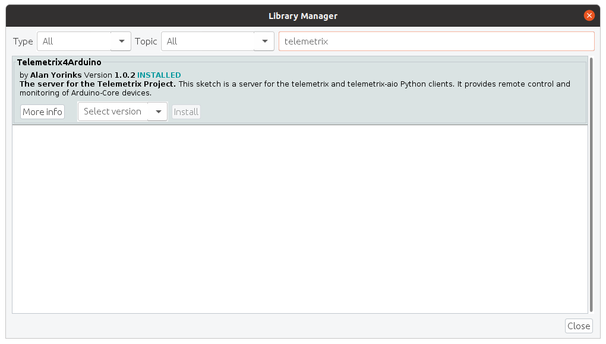
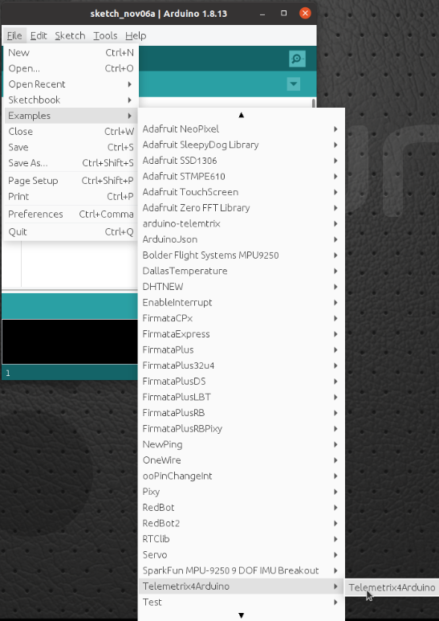
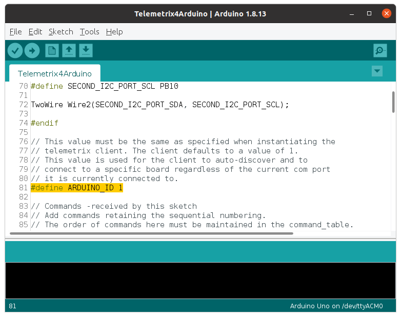

# Telemetrix4Esp8266

## Installation Instructions


<p>1. Open the Arduino IDE and select Tools/Manage Libraries.</p>


<p>2. Enter "Telemtrix4Esp8266 in the search box.</p>


<p>3. Click on the Install button. You will be prompted to allow the installation
of additional libraries. Accept the installation for all.</p>

<p>4. Upload Telemetrix4Arduino to your Arduino-Core board by selecting File/Examples/Telemetrix4Arduino/Telemetrix4Arduino
and then clicking the upload button on the IDE.</p>



## Setting The Telemetrix4Esp8266 Instance ID

Telemetrix4Esp8266, in conjunction with the Telemetrix Project clients, associates a 
specific device with your application.

If you only have a single device connected at a time, you do not need to do anything. However,
if you wish to run multiple devices, you will need to assign a unique ID number to each
device. The ID number is then supplied as an input parameter when your application
 is instantiated.
 


Note that if you wish to change the instance_id for the server, you must edit the 
sketch code and upload the changes to the device.

To match the instance_id on the client side, you will need to specify the arduino_instance id parameter
when instantiating the client class:

```
def __init__(self, com_port=None, arduino_instance_id=1,
                 arduino_wait=4, sleep_tune=0.000001,
                 shutdown_on_exception=True)
```

## Connecting A Telemetrix Client To The TelemetrixESP8266 Server

When first powering up the TelemetrixEsp8266 server, it may take a few seconds
for the ESP8266 to connect to the router. Initially, the sketch turns on the built-in LED.
When the device successfully connects to the router, the LED is extinguished. At that point,
you may start your WiFi application. If the application successfully connects to the ESP device,
you should see something like the following on the application console:

```
Telemetrix Version: 1.4
Copyright (c) 2018-2020 Alan Yorinks All rights reserved.

Successfully connected to: 192.168.2.220:31335
```


<br>
<br>
Copyright (C) 2020 Alan Yorinks. All Rights Reserved.
