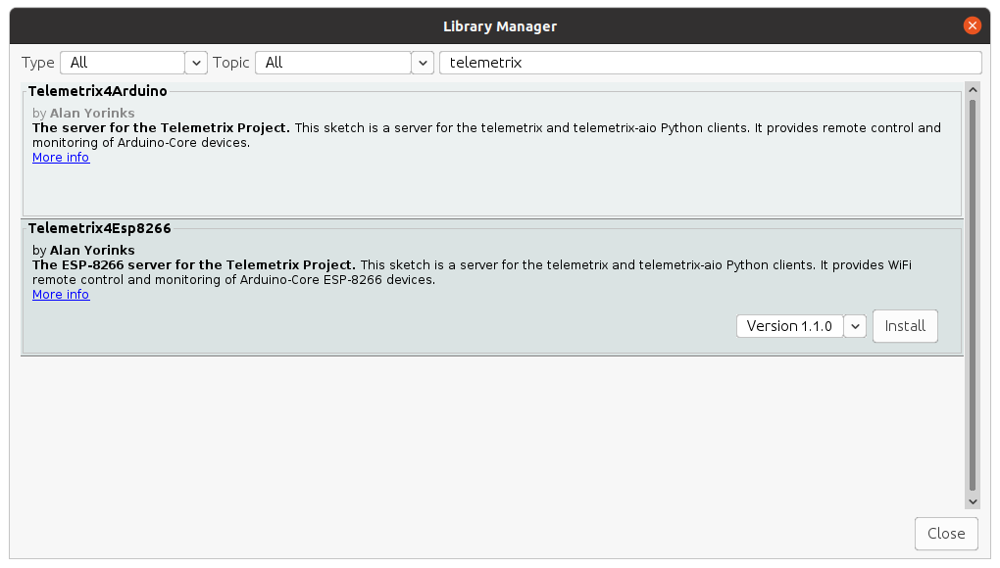
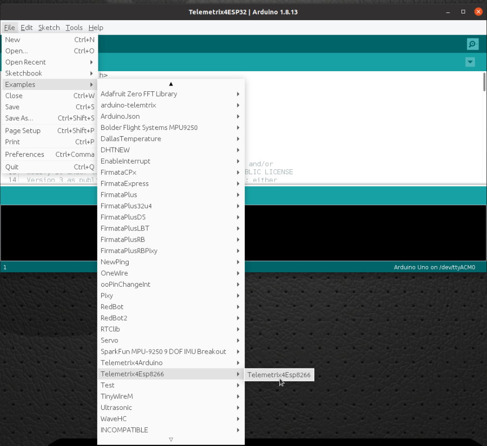
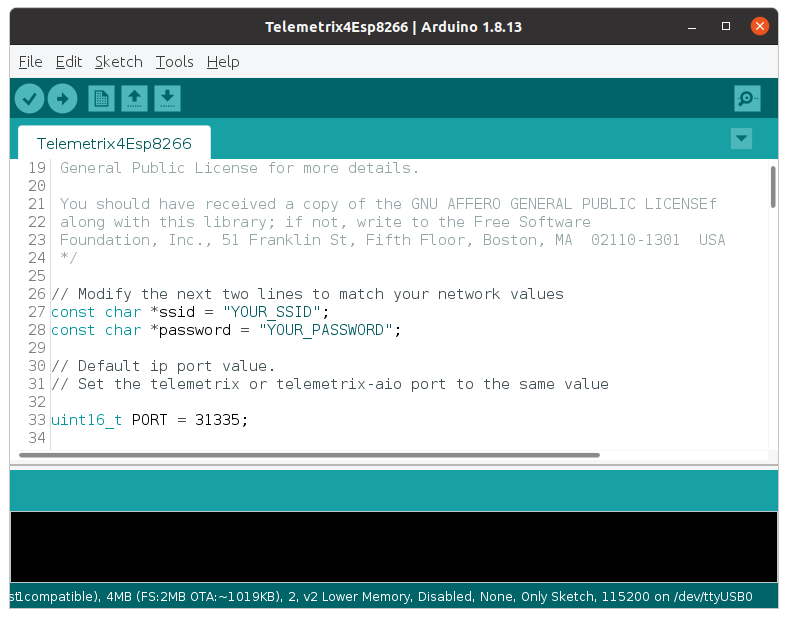
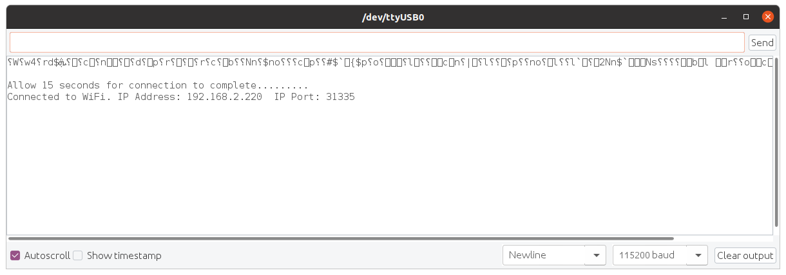

# Telemetrix4Esp8266
The TelemetrixEsp8266 Arduino sketch acts as a TCP/IP server. The following steps explain
installing the sketch and connecting your Telemetrix Python application to an 
ESP-8266 device.

## Installation And Usage Instructions

1. Ensure that you have installed board support for the ESP-8266 into the
Arduino IDE. Instructions
are available [here](https://github.com/esp8266/Arduino#installing-with-boards-manager).

&nbsp;&nbsp;&nbsp;&nbsp;&nbsp;&nbsp;Make sure that you have version 3.1.1 or greater 
installed.

&nbsp;&nbsp;&nbsp;&nbsp;&nbsp;&nbsp;Select your ESP-8266 device type and serial port using the _Tools_ menu within the 
Arduino IDE.


<p>2. Open the Arduino IDE and select Tools/Manage Libraries.</p>


<p>3. Enter "Telemetrix4Esp8266" in the search box.</p>



<p>4. Click on the Install button. You may be prompted to allow the installation
of additional libraries. Accept the installation for all.</p>

<p>5. Upload Telemetrix4Esp8266 to your Arduino-Core board by selecting 
File/Examples/Telemetrix4Esp8266/Telemetrix4Esp8266.
</p>



<p>6. Edit the sketch values for SSID and PASSWORD to match the values
of your network so that the network may assign an IP address to your ESP-8266</p>




<p>7. Connect a USB serial cable to your ESP-8266 device and upload the modified 
Telemetrix4Esp8266 sketch to your device by clicking the
Upload button on the Arduino IDE.
</p>

<p>8. To determine the IP address your router assigned to the device,
open the Arduino IDE Serial Monitor, and set the baud rate to 115200. 
Reset the ESP-8266. If you are using a NodeMCU type device, press the RST button.

The onboard LED will light, and you should see a message on the serial monitor that the 
board is
connecting to your network. Upon successful connection, the onboard LED will be extinguished,
and the IP address and port are displayed on the serial monitor.</p>

<p>NOTE: If you are using multiple ESP-8266 devices for your application, you may set the port value
to be used by modifying the default value in the sketch. 

Make a note of the IP address and port number reported. These will be used when instantiating your Telemetrix Python
application.


You may see some "garbage" characters appear in the serial
monitor resulting from the reset and generated by the ESP-8266. Ignore those characters.



</p>

<p>9. Make sure to set the IP address and port to the values reported in
the serial monitor before instantiating your Python application:</p>
```
 def __init__(self, com_port=None, arduino_instance_id=1,
                 arduino_wait=4, sleep_tune=0.000001,
                 shutdown_on_exception=True,
                 ip_address=None, ip_port=31335):
```

