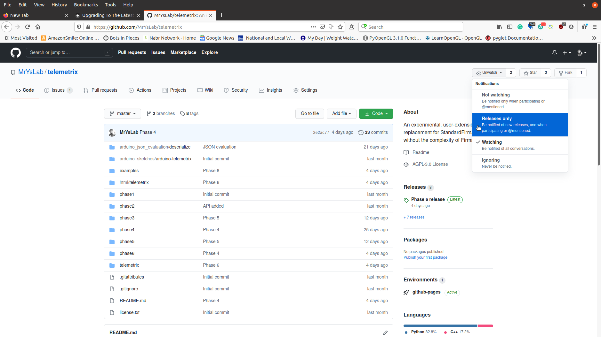

# Getting Notifications Of A New Release And How To Upgrade

## Get Notifications For New Releases From Github

If you have an account on GitHub, you can enable automatic notification when a new release is published.
If you don't have an account, you may create one on the [GitHub site.](https://github.com/)

To enable automatic notifications, go to the telemetrix or telemetrix-aio repository page, 
click on the drop-down list, and select
"Releases Only." When a new release is published, you will receive an email from GitHub.
<br>



## Upgrading To The Latest Version

Whenever a new release is published, it is available on the Python Package Index (PyPI).
To upgrade telemetrix, open a terminal window. 

For Windows users, type:

```python
pip install telemetrix --upgrade
```

For Linux and macOS users, type:
```python
sudo pip3 install telemetrix --upgrade
```

To upgrade telemetrix-aio, open a terminal window. 

For Windows users, type:

```python
pip install telemetrix-aio --upgrade
```

For Linux and macOS users, type:
```python
sudo pip3 install telemetrix-aio --upgrade
```
